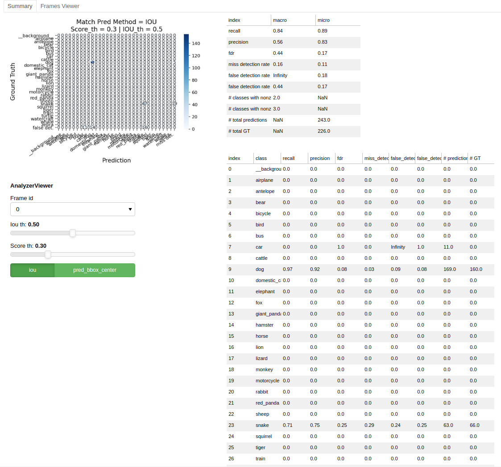
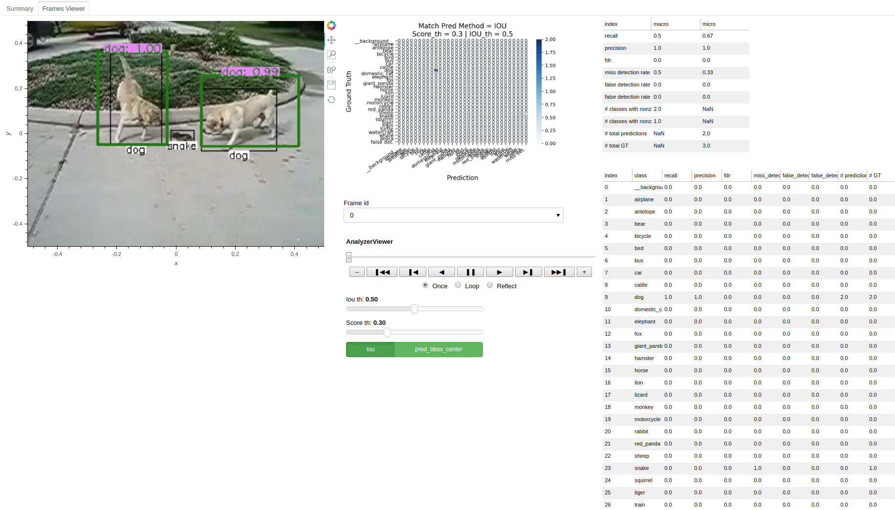

# Object Detection Evaluation (ODEval)
The purpose of this package is to easily evaluate object detection performance in various inference loops.  
Currently, Most object detection papers implementations and open-source use COCO evaluation metrics (average precision / recall). 
Tough very popular, these metrics does not tell the whole story.

This package is a try to fill this gap. The main idea is to extend confusion matrix, designed for classification problem, 
to the case of object detection. This is done by adding False (Miss) Detection row (column).  
After we have a confusion matrix, we can calculate any evaluation metric we want: precision, recall, fdr to name a few.

Main features:
* Calculate detection confusion matrix and related evaluation metrics, per class and global (for all classes).
* Save images with ground truth and prediction bounding boxes. 
* Can be integrated with any inference or training loop by adding few line of code.
* Interactive viewer (beta), can be used to go over inference results, see evaluation metrics for each image separtely, 
change thresholds, etc.

# Installation
In a nutshell:
```
cd path/to/wandted/dir
git clone https://github.com/moshes7/odeval.git
cd odeval
pip install -r requirements.txt
pip install -e .
```

# Basic Usage
See [basic_usage_example.py](analyze/examples/basic_usage_example.py) for basic usage example.  
Sea [viewer_example.py](analyze/examples/viewer_example.py) for interactive viewer example (beta).  

# Output Examples
Confusion matrix  
  

Global performance metrics  
  

Per class performance metrics  
  

Image with overlayed ground truth (black) and prediction (color) bounding boxes  


Interactive viewer  
  
    

# References
[How to Improve Object Detection Evaluation](https://medium.com/moonvision/smart-object-detection-evaluation-with-confusion-matrices-6f2a7c09d4d7)  
[Multi-class Classification: Extracting Performance Metrics From The Confusion Matrix](https://towardsdatascience.com/multi-class-classification-extracting-performance-metrics-from-the-confusion-matrix-b379b427a872)  
[Confusion Matrix for Object Detection](https://github.com/kaanakan/object_detection_confusion_matrix)  
[scikit-learn: Model Evaluatoin, Classification-Metrics](scikit-learn.org/stable/modules/model_evaluatoin.html#classification-metrics) - Section '3.3.2.1 From binary to multiclass and multilabel'.    
[StackExchange answer](https://datascience.stackexchange.com/a/68410)  

