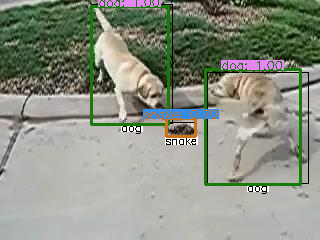

# Object Detection Evaluation (ODEval)
The purpose of this package is to easily evaluate object detection performance in various inference loops.  
Currently, Most object detection papers implementations and open-source use COCO evaluation metrics (average precision / recall). 
Tough very popular, these metrics do not tell the whole story.

This package tries to fill this gap. The main idea is to extend the confusion matrix, designed for classification problem, 
to the case of detection problems. This is done by adding false (miss) Detection row (column) and forming a *generalized* confusion matrix.  
Once we have a generalized confusion matrix, we can calculate basic metrics: True Positive (TP), False Positive (FP), True Negative (TN) and False Negative (FN). 
Then, we can calculate any evaluation metric, such as precision, recall and fdr (see [wikipedia](https://en.wikipedia.org/wiki/Confusion_matrix) for more details).  
We calculate per class (i.e. one versus all or binary classification) and global evaluation metrics. The global metrics are calculated using *macro* and *micro* methods. 
See implemtation in code (e.g. in [confusion_matrix.py](analyze/confusion_matrix.py#L777)) and references for more details. 


Main features:
* Calculate detection confusion matrix and related evaluation metrics, per class and global (*macro* and *micro*).
* Easily save images with ground truth and prediction bounding boxes. 
* Can be integrated with any inference or training loop by adding few line of code, see [basic_usage_example.py](analyze/examples/basic_usage_example.py).
* Interactive viewer (beta), can be used to go over inference results, see evaluation metrics for each image separtely, 
change thresholds, etc. See [viewer_example.py](analyze/examples/viewer_example.py).

# Installation
Optional: Create and activate new virtual environment  
```
cd path/to/new/venv
virtualenv odeval -p python3.6  # 3.6 or higher  
source seq-odeval/bin/activate
```  
Install odeval
```
cd path/to/wandted/dir
git clone https://github.com/moshes7/odeval.git
cd odeval
pip install -r requirements.txt
pip install -e .
```

# Basic Usage
See [basic_usage_example.py](analyze/examples/basic_usage_example.py) for basic usage example.  
See [viewer_example.py](analyze/examples/viewer_example.py) for interactive viewer example (beta).  

# Output Examples
Confusion matrix  
  

Global performance metrics  
  

Per class performance metrics  
  

Image with overlayed ground truth (black) and prediction (color) bounding boxes  


Interactive viewer  
  
    

# References
[How to Improve Object Detection Evaluation](https://medium.com/moonvision/smart-object-detection-evaluation-with-confusion-matrices-6f2a7c09d4d7)  
[Multi-class Classification: Extracting Performance Metrics From The Confusion Matrix](https://towardsdatascience.com/multi-class-classification-extracting-performance-metrics-from-the-confusion-matrix-b379b427a872)  
[Confusion Matrix for Object Detection](https://github.com/kaanakan/object_detection_confusion_matrix)  
[scikit-learn: Model Evaluatoin, Classification-Metrics](scikit-learn.org/stable/modules/model_evaluatoin.html#classification-metrics) - Section *3.3.2.1 From binary to multiclass and multilabel*.  
[StackExchange answer](https://datascience.stackexchange.com/a/68410)  

